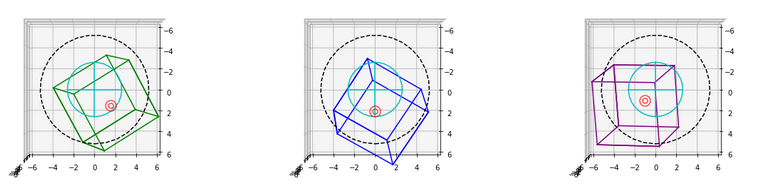
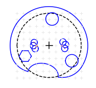

# Neuropixels Protocol Resources

Notebooks and design files for Allen Brain Observatory experimental procedures described in Durand, Ramirez, Heller et al. (2022) protocol paper.

See [Siegle, Jia et al. (2021) *Nature*](https://www.nature.com/articles/s41586-020-03171-x) for an example application of these procedures.


## Design files


**Headframe** (Part #160-100-10_A) - titanium plate used for head fixation.


**Headframe well** (Part #160-200-45) - 3D printed well attached to the headframe. Similar to the well used in 2P experiments, but includes a mating surface for the insertion window and a slot for a ground pin.


**Headframe cap** (Part #0160-200-37) - 3D printed cap that screws into the headframe well to protect the craniotomy between experiments.


**Protective cone** (Part #0160-200-50) - 3D printed cone that protects the probes and manipulators from the mouse's tail during the experiment. Also includes a channel for a mating gold pin for grounding.

See the associated PDF files for manufacturing instructions.


## Notebooks



[*Calculate Insertion Coordinates.ipynb*](Notebooks/Calculate%20Insertion%20Coordinates.ipynb) - Following a calibration procedure, outputs the coordinates required to hit targets in a global coordinate space.



[*Create Insertion Window.ipynb*](Notebooks/Create%20Insertion%20Window.ipynb) - Automatically generate the design for a plastic insertion window customized for individual mice.

### Usage

We recommend using [`conda`](https://docs.conda.io/projects/conda/en/latest/user-guide/install/index.html) to manage the Python environment needed to run these notebooks.

Once `conda` has been installed, you can run:

```bash
$ cd Notebooks
$ conda env create -f environment.yml
$ conda activate probe_alignment
$ jupyter notebook
```

This will launch the Jupyter interface in a browser window, where you can browse through the notebooks and associated Python files.

The relevant documentation for each cell is contained inside the notebook files.


## Contact info

For more information about this repository, contact [joshs@alleninstitute.org](mailto:joshs@alleninstitute.org)


## Terms of use

See [Allen Institute Terms of Use](https://alleninstitute.org/legal/terms-use/)

© 2021 Allen Institute


