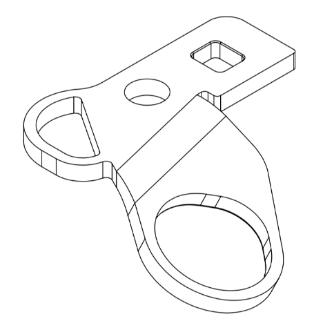
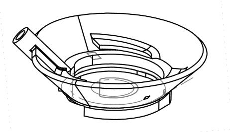
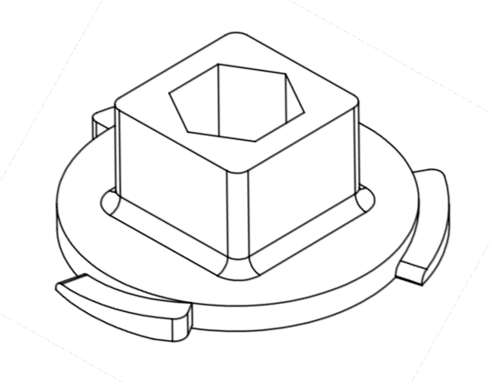
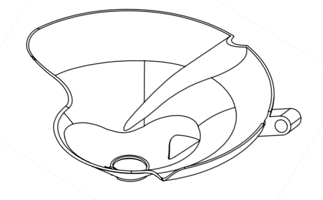

# Neuropixels Protocol Resources

Notebooks and design files for Allen Brain Observatory experimental procedures described in Durand, Ramirez, Heller et al. (2022) protocol paper.

See [Siegle, Jia et al. (2021) *Nature*](https://www.nature.com/articles/s41586-020-03171-x) for an example application of these procedures.

## Design files

*Headframe* (Part #160-100-10_A) - titanium piece used for head fixation.

*Headframe well* (Part #160-200-45) - 3D printed well attached to the headframe. Similar to the well used in 2P experiments, but includes a mating surface for the insertion window and a slot for a ground pin.

*Headframe cap* (Part #0160-200-37) - 3D printed cap that screws into the headframe well to protect the craniotomy between experiments.

*Protective cone* (Part #0160-200-50) - 3D printed cone that protects the probes and manipulators from the mouse's tail during the experiment. Also includes a channel for a mating gold pin for grounding.

## Notebooks

[*Probe targeting.ipynb*](Notebooks/Probe targeting.ipynb) - Following a calibration procedure, outputs the coordinates required to hit targets in a global coordinate space.

## Contact info

For more information about this repository, contact [joshs@alleninstitute.org](mailto:joshs@alleninstitute.org)

## Terms of use

See [Allen Institute Terms of Use](https://alleninstitute.org/legal/terms-use/)

© 2021 Allen Institute